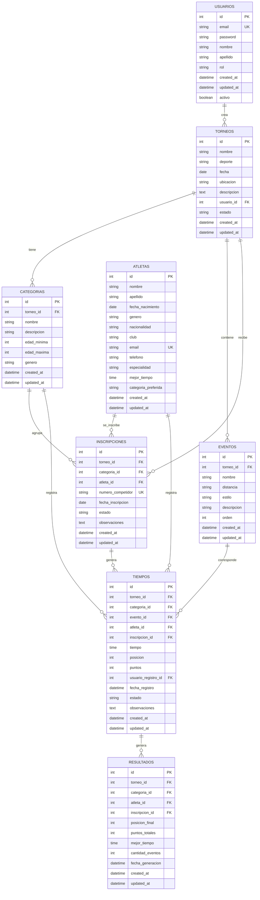

# Diagrama de Base de Datos - Sistema de Gestión de Torneos

## Descripción General

Este documento contiene el diagrama completo de la base de datos para el sistema de gestión de torneos deportivos. El sistema permite gestionar torneos, atletas, inscripciones, tiempos y resultados.

## Diagrama ER (Entity-Relationship)

## Descripción de Entidades

### 1. USUARIOS
Almacena la información de los usuarios del sistema (administradores, jueces, etc.).

**Campos principales:**
- `id`: Identificador único
- `email`: Email único para autenticación
- `password`: Contraseña encriptada
- `nombre`, `apellido`: Nombre completo
- `rol`: Rol del usuario (admin, juez, organizador)
- `activo`: Estado del usuario

**Relaciones:**
- Crea torneos (1:N)
- Registra tiempos (1:N)

### 2. TORNEOS
Representa los torneos deportivos organizados.

**Campos principales:**
- `id`: Identificador único
- `nombre`: Nombre del torneo
- `deporte`: Tipo de deporte (Natación, Triatlón, etc.)
- `fecha`: Fecha de realización
- `ubicacion`: Lugar donde se realiza
- `descripcion`: Descripción detallada
- `estado`: Estado del torneo (planificado, en_curso, finalizado, cancelado)
- `usuario_id`: Usuario que creó el torneo

**Relaciones:**
- Tiene categorías (1:N)
- Contiene eventos (1:N)
- Recibe inscripciones (1:N)
- Genera resultados (1:N)

### 3. CATEGORIAS
Categorías de competencia dentro de un torneo (Sub-18, Libre, Máster, etc.).

**Campos principales:**
- `id`: Identificador único
- `torneo_id`: Torneo al que pertenece
- `nombre`: Nombre de la categoría
- `descripcion`: Descripción de la categoría
- `edad_minima`, `edad_maxima`: Rango de edades
- `genero`: Restricción de género (Masculino, Femenino, Mixto)

**Relaciones:**
- Pertenece a un torneo (N:1)
- Agrupa inscripciones (1:N)
- Registra tiempos (1:N)

### 4. EVENTOS
Eventos o pruebas dentro de un torneo (100m libre, 200m mariposa, etc.).

**Campos principales:**
- `id`: Identificador único
- `torneo_id`: Torneo al que pertenece
- `nombre`: Nombre del evento
- `distancia`: Distancia (100m, 200m, etc.)
- `estilo`: Estilo de natación (libre, mariposa, espalda, pecho, combinado)
- `orden`: Orden de realización

**Relaciones:**
- Pertenece a un torneo (N:1)
- Tiene tiempos registrados (1:N)

### 5. ATLETAS
Información de los atletas participantes.

**Campos principales:**
- `id`: Identificador único
- `nombre`, `apellido`: Nombre completo
- `fecha_nacimiento`: Fecha de nacimiento
- `genero`: Género (Masculino, Femenino)
- `nacionalidad`: País de origen
- `club`: Club o equipo al que pertenece
- `email`: Email de contacto (único)
- `telefono`: Teléfono de contacto
- `especialidad`: Especialidad del atleta
- `mejor_tiempo`: Mejor tiempo personal registrado
- `categoria_preferida`: Categoría preferida

**Relaciones:**
- Se inscribe en torneos (1:N a través de INSCRIPCIONES)
- Registra tiempos (1:N)

### 6. INSCRIPCIONES
Relación entre atletas, torneos y categorías. Representa la inscripción de un atleta en una categoría específica de un torneo.

**Campos principales:**
- `id`: Identificador único
- `torneo_id`: Torneo en el que se inscribe
- `categoria_id`: Categoría en la que participa
- `atleta_id`: Atleta que se inscribe
- `numero_competidor`: Número único de competidor (único)
- `fecha_inscripcion`: Fecha de inscripción
- `estado`: Estado (pendiente, confirmada, cancelada)
- `observaciones`: Notas adicionales

**Relaciones:**
- Pertenece a un torneo (N:1)
- Pertenece a una categoría (N:1)
- Pertenece a un atleta (N:1)
- Genera tiempos (1:N)

### 7. TIEMPOS
Registro de tiempos de los atletas en eventos específicos.

**Campos principales:**
- `id`: Identificador único
- `torneo_id`: Torneo
- `categoria_id`: Categoría
- `evento_id`: Evento en el que se registra el tiempo
- `atleta_id`: Atleta que realiza el tiempo
- `inscripcion_id`: Inscripción relacionada
- `tiempo`: Tiempo registrado (formato TIME)
- `posicion`: Posición obtenida
- `puntos`: Puntos obtenidos
- `usuario_registro_id`: Usuario que registró el tiempo
- `fecha_registro`: Fecha y hora del registro
- `estado`: Estado (pendiente, confirmado, descalificado)
- `observaciones`: Notas adicionales

**Relaciones:**
- Pertenece a un torneo (N:1)
- Pertenece a una categoría (N:1)
- Pertenece a un evento (N:1)
- Pertenece a un atleta (N:1)
- Pertenece a una inscripción (N:1)
- Genera resultados (1:N)

### 8. RESULTADOS
Resultados finales y clasificaciones de los atletas en una categoría.

**Campos principales:**
- `id`: Identificador único
- `torneo_id`: Torneo
- `categoria_id`: Categoría
- `atleta_id`: Atleta
- `inscripcion_id`: Inscripción relacionada
- `posicion_final`: Posición final en la clasificación
- `puntos_totales`: Suma total de puntos
- `mejor_tiempo`: Mejor tiempo registrado
- `cantidad_eventos`: Número de eventos en los que participó
- `fecha_generacion`: Fecha de generación del resultado

**Relaciones:**
- Pertenece a un torneo (N:1)
- Pertenece a una categoría (N:1)
- Pertenece a un atleta (N:1)
- Pertenece a una inscripción (N:1)

## Reglas de Negocio

1. **Inscripciones:**
   - Un atleta puede inscribirse en múltiples categorías del mismo torneo
   - El número de competidor debe ser único por torneo
   - Un atleta solo puede tener una inscripción activa por categoría en un torneo

2. **Tiempos:**
   - Un tiempo debe estar asociado a una inscripción válida
   - El tiempo debe corresponder al evento y categoría de la inscripción
   - Solo usuarios autorizados pueden registrar tiempos

3. **Resultados:**
   - Los resultados se generan a partir de los tiempos registrados
   - La posición final se calcula según los puntos totales
   - Un atleta puede tener un resultado por categoría en un torneo

4. **Categorías:**
   - Las categorías están vinculadas a un torneo específico
   - La edad del atleta debe cumplir con los rangos de la categoría

5. **Eventos:**
   - Los eventos pertenecen a un torneo específico
   - Pueden existir múltiples eventos por torneo
